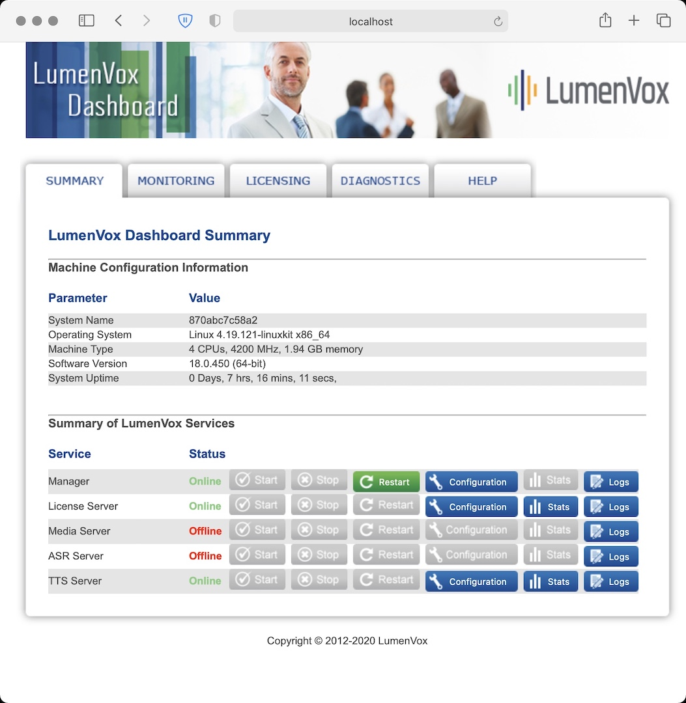

# LumenVox_TTS_Base

LumenVox is a speech automation solutions company providing core speech technologies that include the LumenVox Speech Recognizer, Text-to-Speech Engine, Call Progress Analysis, and Speech Tuner, Natural language solutions support and Multifactor Biometric Authentication. We have won numerous awards for innovation and technical excellence. Based on industry standards, LumenVox's core Speech technology is certified as one of the most accurate, natural sounding, and reliable solutions in the industry. The LumenVox technology provides tools for you to effectively deploy speech-enabled applications to improve the Call Center CX and ROI with LumenVox' flexible, cost-effective software suite.

This image serves as a base for a Java Webservice implementation providing LumenVox based Speech Synthesis

- It contains two voices (Amanda and Chris) the web, 
- native libs, 
- lame MP3 encoder, 
- the LumenVox Core, Client, TTSServer, and LicenseServer.

The license code needs to be provided as an environent variable at container launch like this:

>sudo docker run -d --name lvox -e LV_LIC={12345} -p80:8080 -p8000:8000 lumenvox_tts_base

 Access it via:
 http://localhost/TTSServer/

 Look inside:
 docker exec -it lvox /bin/bash

E.g:
/etc/lumenvox/utilities/lv_show_config -a

ConfigFile /etc/lumenvox/sre_server.conf not found
ConfigFile /etc/lumenvox/media_server.conf not found
  +- SRE Server settings file expected at /etc/lumenvox/sre_server.conf could not be found.
  |
  +- TTS Server settings loaded from /etc/lumenvox/tts_server.conf
    |
    GLOBAL
      |
      +- VERSION                      : 18.0.450
      +- PORT_NUM                     : 7579                (default)
      +- INVALID_FILEPATH_BEHAVIOR    : IGNORE              (default)
      +- NUM_SYNTHESIS_THREADS        : 1                   (default)
      +- LOGGING_VERBOSITY            : 1                   (default)
      +- APP_STAT_LOGGING             : 1                   (default)
      +- VOICE_MAPPING                :                     (default)
	

#### Get the image from dockerhub
Get this container with:
docker pull techcasita/lumenvox_tts_base

#### Or build the image locally

docker build -t lumenvox_tts_base .

### Web UI 

### Web Management UI 

